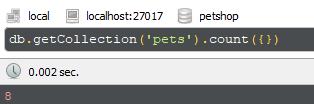
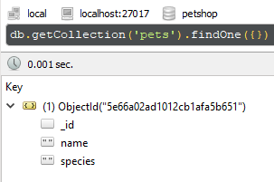
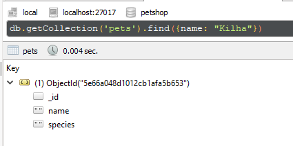
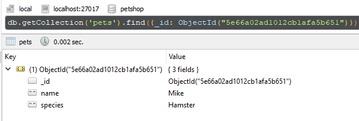
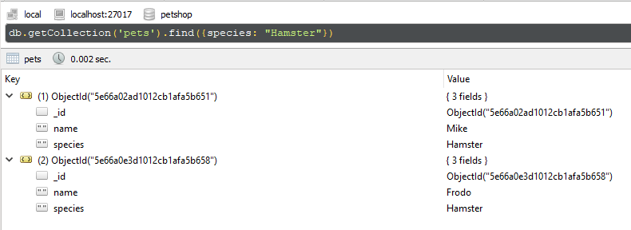
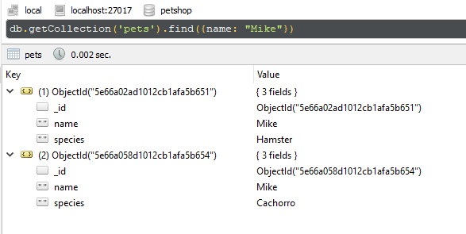
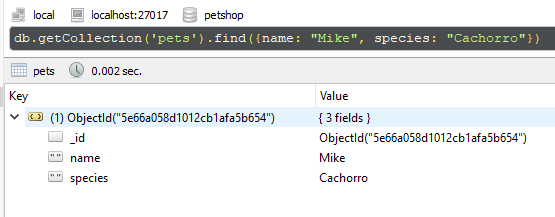

### 1. Adicione outro Peixe e um Hamster com nome Frodo  
##### db.pets.insert({species: "Peixe"})  
##### db.pets.insert({name: "Frodo", species: "Hamster"})   

### 2. Faça uma contagem dos pets na coleção  
##### db.getCollection('pets').count({}) 
   

### 3. Retorne apenas um elemento o método prático possível 
##### db.getCollection('pets').findOne({})
  

### 4. Identifique o ID para o Gato Kilha. 
##### db.getCollection('pets').find({name: "Kilha"})
##### db.getCollection('pets').find({name: "Kilha"},{_id: 1})
  

### 5. Faça uma busca pelo ID e traga o Hamster Mike
##### db.getCollection('pets').find({_id: ObjectId("5e66a02ad1012cb1afa5b651")})
  
  

### 6. Use o find para trazer todos os Hamsters 
##### db.getCollection('pets').find({species: "Hamster"})
  
  

### 7. Use o find para listar todos os pets com nome Mike 
##### db.getCollection('pets').find({name: "Mike"})
  
  

### 8. Liste apenas o documento que é um Cachorro chamado Mike
##### db.getCollection('pets').find({name: "Mike", species: "Cachorro"})  
  
  