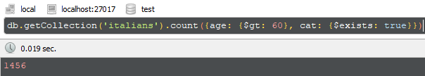

### 1. Adicione outro Peixe e um Hamster com nome Frodo  
##### db.pets.insert({species: "Peixe"})  
##### db.pets.insert({name: "Frodo", species: "Hamster"})   

### 2. Faça uma contagem dos pets na coleção  
##### db.getCollection('pets').count({}) 
   

### 3. Retorne apenas um elemento o método prático possível 
##### db.getCollection('pets').findOne({})
  

### 4. Identifique o ID para o Gato Kilha. 
##### db.getCollection('pets').find({name: "Kilha"})
##### db.getCollection('pets').find({name: "Kilha"},{_id: 1})
  

### 5. Faça uma busca pelo ID e traga o Hamster Mike
##### db.getCollection('pets').find({_id: ObjectId("5e66a02ad1012cb1afa5b651")})
  
  

### 6. Use o find para trazer todos os Hamsters 
##### db.getCollection('pets').find({species: "Hamster"})
  
  

### 7. Use o find para listar todos os pets com nome Mike 
##### db.getCollection('pets').find({name: "Mike"})
  
  

### 8. Liste apenas o documento que é um Cachorro chamado Mike
##### db.getCollection('pets').find({name: "Mike", species: "Cachorro"})  
  
  
  
  
  
## Exercício 2 – Mama mia!  
  
### 1. Liste/Conte todas as pessoas que tem exatamente 99 anos. Você pode usar um count para indicar a quantidade.  
   
##### db.getCollection('italians').find({age: 99})  
  
  
  

##### db.getCollection('italians').count({age: 99})  
  
  
  
  
### 2. Identifique quantas pessoas são elegíveis atendimento prioritário (pessoas com mais de 65 anos)  
  
##### db.getCollection('italians').count({age: {$gt: 65}}) 
  
  
  
  
### 3. Identifique todos os jovens (pessoas entre 12 a 18 anos).  
  
##### db.getCollection('italians').count({age: {$gte: 12}, age: {$lte: 18}})
  
  
  
  
### 4. Identifique quantas pessoas tem gatos, quantas tem cachorro e quantas não tem nenhum dos dois    

##### db.getCollection('italians').count({cat: {$exists: true}})
  
  
  
  
##### db.getCollection('italians').count({dog: {$exists: true}})
    
  
  
  
##### db.getCollection('italians').count({dog: null, cat: null})
    
  
  
  
### 5. Liste/Conte todas as pessoas acima de 60 anos que tenham gato  
  
##### db.getCollection('italians').count({age: {$gt: 60}, cat: {$exists: true}})  
  
  
  
  
### 6. Liste/Conte todos os jovens com cachorro  
  
##### db.getCollection('italians').count({age: {$lt: 30}, dog: {$exists: true}})
    
  
  
  
### 7. Utilizando o $where, liste todas as pessoas que tem gato e cachorro  
  
##### db.getCollection('italians').count({$where: function(){return this.cat && this.dog}})
    
  
  
  
### 8. Liste todas as pessoas mais novas que seus respectivos gatos.  
 
##### db.getCollection('italians').count({$where: function(){return this.cat && this.age < this.cat.age}})
    
  
   
  
### 9. Liste as pessoas que tem o mesmo nome que seu bichano (gatou ou cachorro)  
  
##### db.getCollection('italians').count({$where: function(){return (this.cat && this.firstname == this.cat.name) || (this.dog && this.firstname == this.dog.name)}})
    
  
  
  
### 10. Projete apenas o nome e sobrenome das pessoas com tipo de sangue de fator RH negativo  
  
##### db.getCollection('italians').find({bloodType: "RH-"}, {firstname: 1, surname: 1})
    
  
    
  
### 11. Projete apenas os animais dos italianos. Devem ser listados os animais com nome e idade. Não mostre o identificado do mongo (ObjectId)  
  
##### db.getCollection('italians').find({$where: function(){return (this.cat) || (this.dog)}}, {"dog.name": 1, "dog.age": 1, "cat.name": 1, "cat.age": 1, _id: 0})
    
  
  
  
### 12. Quais são as 5 pessoas mais velhas com sobrenome Rossi?  
  
##### db.getCollection('italians').find({surname: "Rossi"}).sort({age: -1}).limit(5)
    
  
  
  
### 13. Crie um italiano que tenha um leão como animal de estimação. Associe um nome e idade ao bichano  
  
db.getCollection('italians').insert({"firstname":"Luna","surname":"Milena","username":"user1000","age":25.0,
"email":"Luna.Milena@hotmail.com","bloodType":"AB-","id_num":"477330801245","ticketNumber":8211.0,"leao":{"name":"Enzo","age" : 7.0}})
    
  
  
  
### 14. Infelizmente o Leão comeu o italiano. Remova essa pessoa usando o Id.  
  
##### db.getCollection('italians').remove({_id: ObjectId("5e67d27fcc4b6d5b20e32efd")})  
  
  
  
  
### 15. Passou um ano. Atualize a idade de todos os italianos e dos bichanos em 1.  
  
##### db.getCollection('italians').update({}, {$inc: {age: 1, "cat.age": 1, "dog.age": 1}}, {multi: true});   
  
  
  
  
### 16. O Corona Vírus chegou na Itália e misteriosamente atingiu pessoas somente com gatos e de 66 anos. Remova esses italianos.  
  
##### db.getCollection('italians').remove({age: 66, cat: {$exists: true}, dog: {$exists: false}})   
  
  
  
  
### 17. Utilizando o framework agregate, liste apenas as pessoas com nomes iguais a sua respectiva mãe e que tenha gato ou cachorro.  
  
db.getCollection('italians').aggregate([
    {$match: {mother: {$exists: true}}},
    {$match: {$or: [{dog: {$exists: true}}, {cat: {$exists: true}}]}},
    {$project: {firstname: 1, mother: 1, dog: 1, cat: 1,
        'isEqual': {$cmp: ['$firstname', '$mother.firstname']} 
    }},
    {$match: {'isEqual':0}}    
]);  
  
  
  
  
### 18. Utilizando aggregate framework, faça uma lista de nomes única de nomes. Faça isso usando apenas o primeiro nome  
  
##### db.getCollection('italians').aggregate([{$group: {_id: '$firstname'}},{$project: {firstname: 1}}]);   
  
  
  
  
### 19. Agora faça a mesma lista do item acima, considerando nome completo.  
  
##### db.getCollection('italians').aggregate([{$group: {_id: {firstname: '$firstname', surname: '$surname'}}},{$project: {firstname: 1}}]);   
  
  
  
  
### 20. Procure pessoas que gosta de Banana ou Maçã, tenham cachorro ou gato, mais de 20 e  menos de 60 anos.  
  
db.getCollection('italians').aggregate([
    {$match: {favFruits: {$exists: true}}},   
    {$match: {$or: [{dog: {$exists: true}}, {cat: {$exists: true}}]}},
    {$match: {age: {$gt: 20}, age: {$lt: 60}}},
    {$project: {firstname: 1, mother: 1, dog: 1, cat: 1, favFruits: 1,
      "has_banana" : {
        $in: [ "Banana", "$favFruits" ]
      },
      "has_maca" : {
        $in: [ "Maçã", "$favFruits" ]
      }}},
    {$match: {$or: [{'has_banana': true}, {'has_maca': true}]}}
]);  
  
  

  
